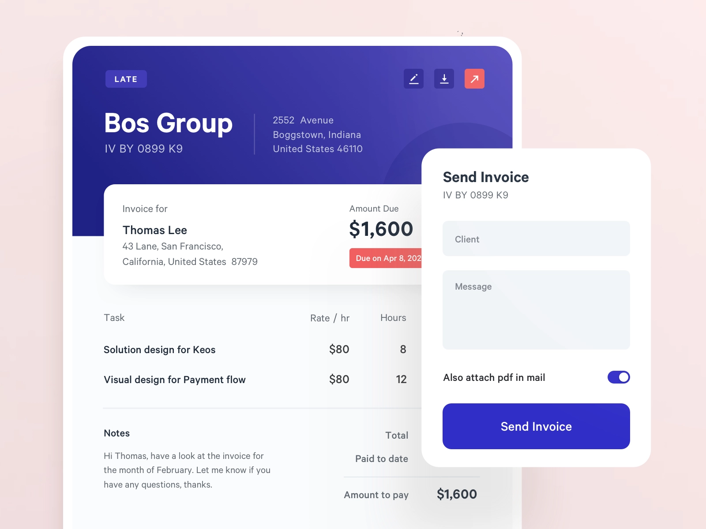

<h2 align="center"><u>Kerosine Invoicing Application</u></h2>

<h4 align="center"> Simplifiy your small business with this handy tool. </h4>

    
 
    
    
    
    
    
 
    

### [+] Description
This application was created as a way to help me bill my clients for freelance work and have that data accessible anywhere online so that it doesnt face the same drawbacks as papers, computers and physical storage.

This application is also supposed to showcase my Backend Engineering and DevOp skills to those interested. It features a front end and back end client all Dockerizable and ready to deploy on Heroku and any self-managed or fully managed Docker and Kubernetes environment.

### [+] Installation
 - `git clone https://github.com/ocdkerosine/kerosine-invoicing.git`
 - `cd backend/ && cp .env.example .env && cd ..`
 - `docker-compose up`

### [+] Usage
`visit http://localhost:3500 to use the app`

### [+] Credits 
<a href="https://github.com/ocdkerosine/kerosine-invoicing">ocdkerosine</a>

### [+] Find me on 

